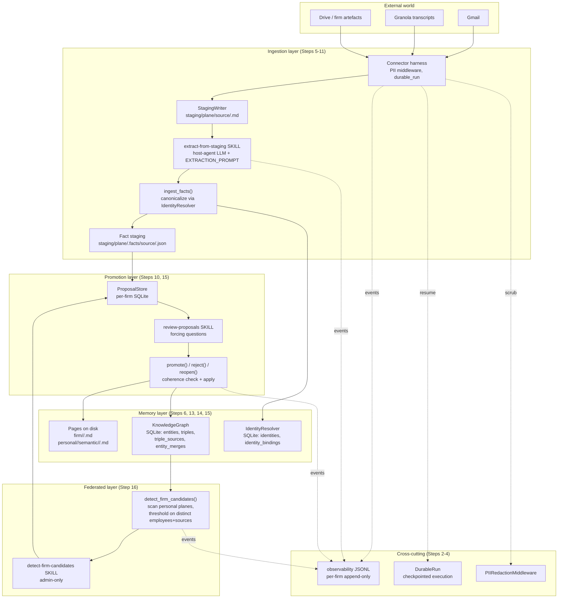

# Memory Mission — Architecture

*Current shipped state, 2026-04-22. For the "why" see [VISION.md](VISION.md). For per-step history see [BUILD_LOG.md](../BUILD_LOG.md). For the domain model see [ABSTRACTIONS.md](ABSTRACTIONS.md).*

---

## Design principles

### 1. Two planes, one-way bridge

Memory Mission splits firm knowledge into **personal planes** (per-employee, private) and a **firm plane** (shared, governed). The only path from personal to firm is the promotion pipeline — `create_proposal` → `review-proposals` skill surfaces to a human → `promote()` with required rationale. Nothing else writes to the firm plane.

### 2. Filesystem as single source of truth

The on-disk markdown vault is authoritative for pages. The SQLite knowledge graph and the observability JSONL log are derived indexes built from promotion events. Any of them can be rebuilt by replaying the other two. When they disagree, filesystem + promotion audit trail win.

### 3. Provenance mandatory

Every fact traces to source. Every promotion records reviewer + rationale. Every corroboration appends to `triple_sources` with the new source. The audit chain never loses a node.

### 4. Deterministic primitives, human judgment

Mechanical work (corroborate, check coherence, detect federated patterns, merge entities) is pure Python + SQL + Pydantic — no LLM, no probabilistic reasoning in the core primitives. Editorial work (approve proposals, merge identities, change tiers) routes through human review. This split is load-bearing: eval strategy (see `EVALS.md`) relies on it, and compliance audits rely on it.

### 5. LLM lives with the host agent

Memory Mission ships prompt templates, typed schemas, ingest validators, and skill markdown. It never imports an LLM SDK (`anthropic`, `openai`, `google-generativeai`). The host agent — Claude Code, Codex, Hermes — runs the model. This keeps the library deployable in any runtime and keeps model-provider choice with whoever has the API key.

### 6. Per-firm isolation

One firm = one directory tree + one SQLite knowledge graph + one identity resolver + one proposal store + one observability log. Paths are fenced; cross-firm queries are not possible by construction. Firms are deployed as separate instances.

### 7. Coherence under change

Lower tiers (`decision` < `policy` < `doctrine` < `constitution`) must not silently contradict higher tiers. The promotion pipeline emits `CoherenceWarningEvent` for every conflict detected. Firms in `constitutional_mode` have `CoherenceBlockedError` raised before the write lands.

### 8. Identity is infrastructure, not a feature

Stable `PersonID` / `OrgID` from an `IdentityResolver` backs every reference. The LLM emits free-form entity names + identifiers; canonicalization happens at `ingest_facts()` time before anything touches the KG. Downstream code speaks in stable IDs.

### 9. Adapter pattern for external services

Three places where external services plug in, all via the same pattern (Protocol + local default impl + optional external adapter): `Connector` (Composio / Gmail / Drive / Granola), `EmbeddingProvider` (OpenAI / Gemini / local hash stub), `IdentityResolver` (Graph One / Clay / firm-custom / local email-based). Ship the Protocol; host wires the service.

### 10. Skills are markdown

Workflows live as `skills/<name>/SKILL.md` with YAML frontmatter (`name`, `version`, `triggers`, `tools`, `preconditions`, `constraints`, `category`) and a destinations-and-fences body. Registered in `skills/_index.md` (human-readable) + `skills/_manifest.jsonl` (machine-readable). The host-agent runtime loads them.

### 11. Rereadability

Evidence is preserved at the substrate level so the system can reread its own past under a newer ontology. The staging layer (`src/memory_mission/ingestion/staging.py`) keeps `<wiki_root>/staging/<plane>/.../<source>/.raw/<item_id>.json` — the connector response verbatim — alongside the extracted markdown. The MemPalace evidence layer (ADR-0004) keeps the same raw chunks indexed by drawer. Every triple in the KG carries `source_closet` + `source_file`; `triple_sources` is append-only and never overwrites. None of this is incidental: when the ontology evolves (a new predicate lands in `docs/OPERATING_STATE.md`, a fact bucket changes shape, a status enum gains a value), the substrate is structurally capable of replaying extraction over preserved evidence to produce facts under the new schema. The orchestration primitive (`re_extract_staged_item`, etc.) is signal-gated; the substrate itself is not.

---

## System diagram



---

## Three representations, one authority

Firm state exists in three derived forms simultaneously. They must never diverge permanently; when they disagree, the rule is: **filesystem + observability audit log win, KG is rebuildable from promotion events**.

| Layer | Storage | Built from | Owned by |
|---|---|---|---|
| Pages | `firm/<domain>/<slug>.md` + `personal/<emp>/semantic/<domain>/<slug>.md` | direct writes via `promote()` and curator workflows | `memory/pages.py`, `memory/engine.py` |
| Knowledge graph | `<firm>/firm-kg.sqlite3` | replay of promote() facts via `_apply_facts` | `memory/knowledge_graph.py` |
| Observability log | `<firm>/events.jsonl` | append-only on every event | `observability/logger.py` |

The KG is a derived index. If it corrupts, rebuild from promotion events. The observability log is authoritative for "what happened"; pages are authoritative for "what is currently true."

---

## Module walkthrough

### `src/memory_mission/observability/` — component 0.4

Append-only JSONL per firm, scoped by a context manager (`observability_scope`) that injects `firm_id` / `employee_id` / `trace_id` into every event. Event types are a Pydantic discriminated union: `ExtractionEvent`, `PromotionEvent`, `RetrievalEvent`, `DraftEvent`, `ConnectorInvocationEvent`, `ProposalCreatedEvent`, `ProposalDecidedEvent`, `CoherenceWarningEvent`.

Public API: `observability_scope(...)`, `log_extraction(...)`, `log_retrieval(...)`, `log_proposal_created(...)`, `log_proposal_decided(...)`, `log_coherence_warning(...)`, `log_draft(...)`, `log_connector_invocation(...)`.

Path safety: `firm_id` is validated against a regex and resolved-path check to block traversal.

### `src/memory_mission/durable/` — component 0.6

Checkpointed execution for long-running ingestion loops. `DurableRun` wraps a loop, persists per-step state to a per-firm SQLite thread store, and resumes from the last checkpoint on restart. Integrates with observability — durable runs auto-seed `trace_id` into thread state so events and resume state correlate post-hoc.

Terminal states are respected: a completed thread cannot be flipped back to running by a reopen.

### `src/memory_mission/middleware/` — component 0.7

`MiddlewareChain` wraps LLM calls with deterministic middleware. Primary member today: `PIIRedactionMiddleware` with a public `.scrub(text)` API. Compliance-focused rules (8-17 digit account numbers, email addresses, phone numbers) plus a generic structured-data redaction pass.

`ModelCall` / `ModelResponse` are frozen Pydantic — middleware uses `model_copy(update=...)` to produce the next-in-chain value; accidental mutation is structurally blocked.

### `src/memory_mission/ingestion/` — Steps 5 + 7 + P2 + venture-pack

The full ingestion stack lives here: connectors (1.3), capability-based binding manifest (P2), per-app envelope helpers, staging writer, and mention tracking.

**`connectors/`** — `Connector` Protocol + local test doubles + Composio-backed implementations for **Gmail, Outlook, Google Calendar, Granola, Google Drive, OneDrive/SharePoint, Affinity, Attio, HubSpot, Notion, Slack** (11 apps). Every invocation flows through a shared harness (`invoke()`) that threads observability + PII scrub + trace_id correlation. The Composio SDK is a stub — the `ComposioClient` Protocol is defined; the host injects a real client at deploy time, or a host using MCP servers directly skips the harness and calls envelope helpers + `StagingWriter.write_envelope` directly.

**`roles.py`** — `ConnectorRole` StrEnum (`EMAIL` / `CALENDAR` / `TRANSCRIPT` / `DOCUMENT` / `WORKSPACE` / `CHAT` — see ADR-0011 for the chat addition) + `NormalizedSourceItem` Pydantic envelope (frozen, `extra="forbid"`). Every connector emits this single shape before staging — no per-connector special-cases downstream.

**`systems_manifest.py`** — `SystemsManifest` + `RoleBinding` + `VisibilityRule` Pydantic + `load_systems_manifest(path)` loader + `map_visibility(metadata, *, role, manifest) -> str` runtime primitive. Loaded from `firm/systems.yaml`. Mapping is **fail-closed by default**: a binding without `default_visibility` raises `VisibilityMappingError` on unmappable items. ADR-0007. Operator recipe at `docs/recipes/systems-yaml.md`.

**`envelopes.py`** — 11 per-app helpers (`gmail_message_to_envelope`, `outlook_message_to_envelope`, `calendar_event_to_envelope`, `granola_transcript_to_envelope`, `drive_file_to_envelope`, `onedrive_item_to_envelope`, `affinity_record_to_envelope`, `attio_record_to_envelope`, `hubspot_record_to_envelope`, `notion_page_to_envelope`, `slack_message_to_envelope`). Each is a pure function that picks the per-app visibility surface out of the raw payload, calls `map_visibility`, and emits a `NormalizedSourceItem`. The Slack helper additionally encodes a structural plane override — DMs/MPDMs are always `target_plane="personal"` regardless of binding (ADR-0011).

**`staging.py`** — `StagingWriter` writes envelopes to `<wiki_root>/staging/<plane>/<source>/` via `write_envelope(item)` — atomic `.tmp → rename`, path-safety checks, structural frontmatter (`target_scope`, `source_role`, `external_object_type`, `container_id`, `url`, `modified_at`). The pre-existing `write()` method stays for ad-hoc / non-envelope cases.

**`mentions.py`** — `MentionTracker` per-firm SQLite store of entity counts; `record()` returns `(prev_tier, new_tier)` so the extraction skill can fire higher-tier enrichment on threshold crossings (GBrain's 1 / 3 / 8 thresholds).

### `src/memory_mission/memory/` — components 0.1 + 0.2 + Steps 6, 13, 15

- **`pages.py`** — parse/render compiled-truth + timeline markdown; `PageFrontmatter` Pydantic (slug, title, domain, aliases, sources, validity window, confidence, **tier**).
- **`schema.py`** — domain registry (`people`, `companies`, `deals`, `meetings`, `concepts`, `sources`, `inbox`, `archive`) and path helpers (`plane_root`, `curated_root`, `page_path`, `staging_source_dir`).
- **`engine.py`** — `BrainEngine` Protocol + `InMemoryEngine` in-memory implementation. `put_page`, `get_page`, `list_pages`, `search`, `query` (hybrid search with RRF + compiled-truth boost + cosine blend). `query()` accepts `tier_floor` for authority-filtered retrieval.
- **`search.py`** — hybrid retrieval primitives (`EmbeddingProvider` Protocol, `HashEmbedder` default, `rrf_fuse`, `cosine_similarity`, `COMPILED_TRUTH_BOOST=2.0`, `RRF_K=60`, `VECTOR_RRF_BLEND=0.7`).
- **`knowledge_graph.py`** — SQLite temporal knowledge graph. Tables: `entities`, `triples`, `triple_sources`, `entity_merges`. Core ops: `add_entity`, `add_triple`, `invalidate`, `query_entity`, `query_relationship`, `timeline`, `find_current_triple`, **`corroborate`** (Noisy-OR capped at 0.99), **`merge_entities`** (reviewer-gated), **`check_coherence`** (deterministic conflict detector), **`sql_query`** (read-only SQL surface), `scan_triple_sources` (the join the federated detector needs), `stats`.
- **`tiers.py`** — `Tier = Literal["constitution", "doctrine", "policy", "decision"]` with ordinal helpers (`tier_level`, `is_above`, `is_at_least`).
- **`text.py`** — `word_set` + `jaccard` (lifted from agentic-stack).
- **`salience.py`** — `salience_score(entry)` formula (lifted from agentic-stack).

### `src/memory_mission/extraction/` — Step 9

- **`schema.py`** — Pydantic discriminated union of six fact kinds: `IdentityFact`, `RelationshipFact`, `PreferenceFact`, `EventFact`, `UpdateFact`, `OpenQuestion`. Every fact carries `confidence` (0-1) + `support_quote` (non-empty) — "no quote, no fact". `ExtractionReport` bundles facts + metadata.
- **`prompt.py`** — `EXTRACTION_PROMPT` markdown template: the six schemas + a worked venture-firm example + rules. Host agent feeds this to its LLM.
- **`ingest.py`** — `ExtractionWriter` (per-plane, per-source persistence), `ingest_facts(report, *, wiki_root, mention_tracker, identity_resolver)` — the canonicalization step. When a resolver is provided, `IdentityFact.identifiers` are resolved to stable `p_<id>` / `o_<id>`; every fact in the report that references the same raw name is rewritten. The canonicalized report is what lands in fact staging.
- **`dry_run.py`** — narrow-slice pilot preview helpers. `select_staged_items` filters staged source items by explicit IDs, meeting IDs, tag, entity text, and date range with a max-size guard. `write_extraction_dry_run` turns host-produced `ExtractionReport`s into `staging/<plane>/<source>/.dry_run/<run_id>.jsonl`, dropping low-confidence facts and making no KG / page / proposal / fact-staging writes.

### `src/memory_mission/identity/` — Step 14

- **`base.py`** — `IdentityResolver` Protocol (`resolve` / `lookup` / `bindings` / `get_identity`), `Identity` Pydantic, `IdentityConflictError`, `parse_identifier`, `make_entity_id` (`p_<token>` / `o_<token>`).
- **`local.py`** — `LocalIdentityResolver` — SQLite-backed default. Exact-match on `type:value` identifiers. Conservative by design (no fuzzy name match in V1) — false negatives are recoverable via `merge_entities`, false positives are expensive.

### `src/memory_mission/promotion/` — Step 10

- **`proposals.py`** — `Proposal` + `DecisionEntry` + `ProposalStatus` + `ProposalStore` (per-firm SQLite queue indexed on status / target_entity / target_plane). Deterministic `proposal_id` from inputs means `create_proposal` is idempotent — re-extraction from the same source returns the existing pending proposal.
- **`pipeline.py`** — `create_proposal`, `promote` (accepts optional `policy: Policy | None` for constitutional mode), `reject`, `reopen`. Shared `_apply_facts` two-pass: (1) coherence scan emits `CoherenceWarningEvent`s, raises `CoherenceBlockedError` in strict mode; (2) `_add_or_corroborate` routes each triple-like fact to `corroborate` (if currently-true match exists) or `add_triple` (if new).

### `src/memory_mission/permissions/` — Step 8

`Policy` Pydantic (firm_id, scopes, employees, default_scope, **constitutional_mode**) + `can_read(policy, employee_id, page)` + `can_propose(policy, employee_id, target_scope)`. No-escalation rule on propose: can't propose into a scope you can't read. Pure library — host-agent skills call as utilities.

### `src/memory_mission/federated/` — Step 16

`FirmCandidate` + `CandidateSource` Pydantic, `detect_firm_candidates(kg, *, min_employees=3, min_sources=3)` (deterministic SQL scan + grouping), `propose_firm_candidate(candidate, *, store)` (uses `create_proposal` for idempotency). The dominant failure mode — three employees ingesting one shared transcript — is caught by the distinct-source-file threshold.

### `src/memory_mission/personal_brain/` — Step 12

Per-employee four-layer brain: `working/WORKSPACE.md` (current task state, 2-day archive), `episodic/AGENT_LEARNINGS.jsonl` (salience-ranked), `semantic/<domain>/<slug>.md` (curated pages — existing shape moved under `semantic/`), `preferences/PREFERENCES.md`, `lessons/lessons.jsonl` + rendered `LESSONS.md`. Workflow agents read these before drafting anything.

### `src/memory_mission/synthesis/` — Step 17 (V1 close)

First workflow-level primitive. `compile_agent_context(role, task, attendees, kg, *, engine=None, plane="firm", tier_floor=None, as_of=None, identity_resolver=None) -> AgentContext` reads across the full stack and returns a structured context package.

- `AgentContext` — top-level Pydantic. Fields: `role`, `task`, `plane`, `as_of`, `tier_floor`, `attendees: list[AttendeeContext]`, `doctrine: DoctrineContext`, `generated_at`. `.render()` produces markdown for the host-agent LLM. Structured form is authoritative; rendering is a convenience.
- `AttendeeContext` — per-attendee neighborhood (Tolaria Neighborhood-mode shape via ADR-0069): `outgoing_triples`, `incoming_triples`, `events`, `preferences`, `related_pages`, plus `coherence_warnings: list[CoherenceWarning]` (Move 3, populated from the observability log when a scope is active).
- `DoctrineContext` — firm-plane pages at or above `tier_floor`, sorted highest-tier first.

Invalidated triples are always excluded. Events are sorted newest-first. Classification is predicate-based: `event` → events, `prefers` → preferences, everything else → outgoing_triples. Rendering emits an Obsidian-native `> [!contradiction]` callout above each attendee when unresolved coherence warnings exist.

Consumed by `skills/meeting-prep/`. Other workflow skills (email-draft, deal-memo, CRM-update) reuse the same primitive with different `role` values — the package is composable.

### `src/memory_mission/mcp/` — Step 18

Multi-user agent surface. Wraps the existing engine + KG + promotion primitives in an MCP server so any MCP-compatible host (Claude Code, Cursor, Codex, Hermes) can integrate without a bespoke Python adapter.

- `auth.py` — loads `firm/mcp_clients.yaml`, maps `employee_id` → scopes (`read` / `propose` / `review`). Unknown employees fail closed.
- `context.py` — `McpContext` holds process-wide handles (engine, kg, store, identity, policy) plus the validated employee + scope set. `tool_scope()` wraps every tool call in an `observability_scope`.
- `tools.py` — 14 thin wrappers (8 read, 6 write). No new domain logic — every tool delegates to the same primitives the Python API uses.
- `server.py` — FastMCP registrations + the `python -m memory_mission.mcp` CLI. `initialize_from_handles()` is the test / embedding seam.

**Access model:** one server process per employee. Host agents spawn it per session with `--firm-root`, `--firm-id`, `--employee-id`. Identity is baked in at startup; every tool call acts on behalf of that employee with `viewer_id` threaded into permission checks. See `docs/adr/0003-mcp-as-agent-surface.md` for the rationale and `docs/recipes/mcp-integration.md` for the operator guide.

**Scope tiers:** `read` covers non-mutating lookups; `propose` adds `create_proposal` + `list_proposals`; `review` adds approve / reject / reopen + `merge_entities`. Raw SQL (`KnowledgeGraph.sql_query`) is NOT exposed over MCP — MCP scope is orthogonal to page-level Policy scope, so a reviewer without `partner-only` access could bypass `viewer_scopes` via SQL. Admins who need raw KG access do it via an in-process Python script.

---

## V1 polish pass (post-Step 17)

Six targeted additions drawn from comparative reviews of Tolaria, claude-obsidian, Google Knowledge Catalog, and Ricky's cloud-code agent stack. All additive, all backwards-compatible.

- **Move 1 — Hot-cache hook recipe.** `docs/recipes/personal-hot-cache.md` documents how to wire host-agent `Stop` / `SessionStart` / `PostCompact` / `PostToolUse` hooks around `personal/<emp>/working/WORKSPACE.md` so the personal plane becomes a live session cache. Personal plane only — firm plane is never session-scoped.
- **Move 2 — Obsidian Bases dashboard + `reviewed_at` frontmatter.** New `PageFrontmatter.reviewed_at: datetime | None = None` field plus a drop-in `src/memory_mission/memory/templates/dashboard.base` with five views (Recent changes / Low confidence / Stale or unreviewed / Constitution + doctrine / By domain). Install guide in `docs/recipes/vault-dashboard.md`. Requires Obsidian ≥ v1.9.10.
- **Move 3 — Contradiction callout rendering.** New `coherence_warnings_for(entity_id, *, since=None)` helper in `observability.api` reads unresolved `CoherenceWarningEvent` rows from the active scope. `render_page()` and `AttendeeContext` rendering emit `> [!contradiction]` callouts when warnings exist, with full subject / predicate / tier detail. Eval-corpus-ready via the structured event stream.
- **Move 4 — AGENTS.md canonical + CLAUDE.md shim.** `docs/AGENTS.md` is canonical (Codex / Gemini / Cursor / Windsurf convention); `CLAUDE.md` at repo root is a one-line `@docs/AGENTS.md` shim. Canonical lives under `docs/` because the repo-root `AGENTS.md` is claimed by the claude-mem session-context tool.
- **Move 5 — Permission-aware `BrainEngine` read path.** `get_page()` / `search()` / `query()` accept optional `viewer_id: str | None` + `policy: Policy | None`. When both supplied, results filtered via `can_read(policy, viewer_id, page)`. Firm-plane pages outside the viewer's scopes drop; personal pages not owned by the viewer drop unconditionally. Closes the read-time permission gap — `can_read` was advisory until now.
- **Move 6 — "Context engine" framing.** VISION / README / EVALS updated to call Memory Mission a "governed context engine for agents" rather than "memory system." Matches how Google Knowledge Catalog markets the pattern; clarifies that we build the layer under the agent, not the agent itself.

---

## Step 18 security-response pass (post-MCP)

Three independent reviewers ran adversarial / security / API-contract / Kieran-Python reviews on the Step 18 diff. Twenty-one findings (B1-B28) landed in six atomic commits, all on `main` at `35c73fb`. Headline fixes:

- **Atomic `_apply_facts`.** Pre-flight `_scope_scan` + `_coherence_scan` catch scope / coherence conflicts before any write. `_add_or_corroborate` idempotent by `source_file`, so retries after a failed `store.save` don't double-corroborate.
- **Fail-closed when `policy=None`.** `_mcp_viewer_scopes` returns `frozenset({"public"})` instead of `None`. `engine._viewer_can_read` requires firm-plane pages to be public when viewer is set but policy is absent. Accidental `protocols/permissions.md` deletion no longer re-exposes scoped data.
- **`sql_query_readonly` removed from MCP.** MCP scope is orthogonal to Policy scope; raw SQL bypassed `viewer_scopes`. Kept as Python API only. `KnowledgeGraph.sql_query` hardened with `PRAGMA query_only = ON` + `ATTACH` / `DETACH` / `PRAGMA` keyword rejection.
- **UpdateFact scope-downgrade blocked.** `_scope_scan` also checks `supersedes_object` scope — invalidate + re-add pattern can no longer silently downgrade.
- **`merge_entities` refuses scope-colocating rewrites.** Pre-check simulates the rewrite; raises if scopes would collide on `(subject, predicate, object)`.
- **Wiki bootstrap symlink + employee_id validation.** `resolve()` + `is_relative_to` check; `validate_employee_id` on personal-plane paths.
- **WAL + busy_timeout on all firm SQLite stores.** One MCP process per employee means multiple writers against one DB file.
- **YAML manifest duplicate-key rejection.** Custom `_NoDupSafeLoader` stops silent "last entry wins" on edit-merge mistakes.
- **`MAX_FACTS_PER_PROPOSAL = 100`.** DoS cap + rubber-stamp mitigation.
- **Generic `AuthError` messages.** Structured `employee_id` + `required_scope` on the exception; caller sees `"insufficient scope"` / `"not authorized"`. Prevents scope-taxonomy enumeration.
- **Typed MCP signatures.** `Direction` / `ProposalStatus` Literal types directly in `@mcp.tool()` registrations — dropped `# type: ignore[arg-type]`.
- **NFKC normalization on `employee_id`.** Manifest + runtime both reject non-canonical Unicode; blocks homoglyph / fullwidth smuggling.
- **Typed `parse_facts` adapter.** `TypeAdapter(ExtractedFact).validate_python` replaces the fabricated ExtractionReport pattern.
- **Structured bootstrap logging.** `_bootstrap_engine_from_wiki` emits `structlog` warnings on every skipped file with a `reason` field.
- **Server version in name.** `memory-mission/v1` so future v2 can coexist.
- **`compile_agent_context` / `render_agent_context` split.** No more union-return tool.

See BUILD_LOG commits `7f01c66 d50913d 889be9e b9e6505 fb85446 33d50f3` for detail.

---

## Next chapter (P1+) — forward pointers

The plan lives at `/Users/svenwellmann/.claude/plans/we-ve-built-this-and-curious-unicorn.md`. Architectural touchpoints:

- **~~Capability-based connector roles.~~ SHIPPED.** `src/memory_mission/ingestion/roles.py` defines `ConnectorRole` (`EMAIL` / `CALENDAR` / `TRANSCRIPT` / `DOCUMENT` / `WORKSPACE` / `CHAT`). Per-firm `firm/systems.yaml` binds roles → concrete apps; envelope helpers normalize each app's raw payload. ADR-0007 (active) + ADR-0011 (`chat` role for Slack-shape integrations, active). Venture-pack of 10 connectors landed on `main` at `42c66e2`.
- **Typed sync-back.** New `src/memory_mission/sync_back/` for outbound mutations on approved facts only (`FieldUpdate`, `StatusChange`, `NoteAppend`, `TaskCreate`, `StructuredSummaryPublish`, `OwnerAssignment`). Idempotent via `(proposal_id, external_id, mutation_kind)`. MCP tool `sync_back_mutation` at REVIEW scope. ADR-0008 when landed.
- **Evidence-pack MCP tool.** `get_evidence_pack(question, plane, tier_floor, limit)` returns `{triples, citations, confidence_aggregate, summary}` without generating prose. Composes over existing `kg.query_*` + hybrid search. Host LLM does prose from the pack. Spanner-inspired pattern, SQLite backend. ADR-0006 when landed.
- **Firm-plane auto-wiring.** `src/memory_mission/promotion/autowire.py` extracts typed entity references from `support_quote` via regex + predicate vocab at `_apply_facts` time. Adds typed edges (`works_at`, `invested_in`, `advises`, `founded`) with zero LLM calls. ADR-0009 when landed.
- **Venture reference overlay.** `overlays/venture/*` — manifest template, extraction-prompt tuning, permission presets, constitution seed. PE + wealth become overlays on the same core.
- **~~Personal-layer substrate.~~ SHIPPED.** MemPalace is adopted behind `PersonalMemoryBackend`; every employee gets an isolated palace under `personal/<employee_id>/mempalace/`. ADR-0004 (active). Hardening pass added a deterministic `MM_SOURCE_ID` marker so search hits resolve to their exact source instead of a content-fuzzy lookup, plus path-traversal defense via `validate_employee_id` before palace path construction.
- **Multimodal spike (optional).** Graphify as optional `pip install graphifyy` dep. `ingest-firm-corpus` skill on onboarding to seed firm KG from PDFs / decks / videos. Must still route through proposal review — cannot bypass governance.
- **Benchmark publication.** `benchmarks/longmemeval.py` (inherits from MemPalace if adopted) + `benchmarks/firm_coherence.py` (ours, unique). Reproducible scripts + dated results under `benchmarks/RESULTS.md`.

---

## Runtime composition

A typical end-to-end flow composes like this:

```python
with observability_scope(observability_root=..., firm_id="acme", employee_id="alice"):
    manifest = load_systems_manifest(Path("firm/systems.yaml"))
    connector = make_gmail_connector(client=composio_client)
    staging = StagingWriter(
        wiki_root=..., source="gmail",
        target_plane="personal", employee_id="alice",
    )
    with durable_run(store=..., thread_id="gmail-backfill-2026-q2", firm_id="acme") as run:
        # Every step checkpointed — resume-on-crash works.
        for message_id in invoke(connector, "list_message_ids", {}).data["ids"]:
            run.step(message_id)
            raw = invoke(connector, "get_message", {"message_id": message_id}).data
            item = gmail_message_to_envelope(raw, manifest=manifest)
            staging.write_envelope(item)  # fail-closed if visibility unmappable
            run.mark_done(message_id)

# ...later, extraction...
with observability_scope(...):
    report = ExtractionReport.model_validate_json(llm_response)
    result = ingest_facts(
        report,
        wiki_root=...,
        mention_tracker=tracker,
        identity_resolver=resolver,  # canonicalizes entity names
    )

# ...later, review...
with observability_scope(...):
    for proposal in store.list(status="pending"):
        # review-proposals SKILL surfaces each one to a human
        promote(store, kg, proposal.proposal_id,
                reviewer_id="partner-1",
                rationale="verified against source",
                policy=policy)  # constitutional_mode gates coherence
```

Every layer logs to the same observability scope; every write to memory carries the same `trace_id`.

---

## Stack

| Layer | Technology | Rationale |
|---|---|---|
| Language | Python 3.12+ | Hermes is Python-native; MemPalace KG ports cleanly; GBrain patterns are ~2-3K LOC to port |
| Data | SQLite (stdlib) for KG, identity, proposals, mentions, durable runs | Zero-dep, per-firm file = per-firm isolation, migration-ready schema for Postgres |
| Storage | Filesystem (markdown + YAML) for pages | Obsidian-compatible, AI-legible, no lock-in |
| Search | Hybrid (keyword + vector, RRF-fused, cosine-blended) via `HashEmbedder` stub | Real embedder slots in via Protocol |
| Models | Pydantic v2 | Typed, frozen, JSON round-trippable |
| Validation | mypy --strict | On every source file |
| Lint / format | ruff + ruff format | Fast, canonical |
| Tests | pytest | 1045 tests, every public surface |
| Runtime | Hermes Agent (primary), Ironclaw / OpenClaw (others) | Skills are markdown; any host that reads frontmatter can load them |

---

## Non-goals

- **Multi-firm SaaS.** V1 and the venture pilot are per-firm-instance. SQLite per firm is now explicit policy (ADR-0005), not a pre-pilot stopgap. Hosted DB is re-evaluated only when a real customer-ask forces the question.
- **LLM runtime.** Host agent owns it. We ship prompts and schemas.
- **UI.** Vault is Obsidian-compatible; review surface is the host agent's chat. A dedicated web UI is a later layer.
- **Automatic conflict resolution.** Coherence warnings are advisory or blocking — never auto-resolving. The reviewer decides.
- **Vendor-specific product.** Concrete apps (Notion, Monday, Salesforce, Attio, Affinity, ...) are interchangeable connector bindings via `firm/systems.yaml`. Never hardcoded.
- **Consumer / personal-memory product.** Tolaria, MemPalace, Rowboat, Supermemory serve that market. Memory Mission is the governed firm-memory substrate; personal-layer optimization is handled behind `PersonalMemoryBackend` (ADR-0004 active), not our product identity.

---

## Data flow: a concrete example

Alice runs the Gmail backfill skill. Three weeks of email stream into `staging/personal/alice/gmail/`. The extract-from-staging skill chews through them — for each message, the host agent calls its LLM with `EXTRACTION_PROMPT`, parses the JSON into an `ExtractionReport`, passes it to `ingest_facts(..., identity_resolver=alice_resolver)`. One `IdentityFact` carries `identifiers=["email:sarah@acme.com", "linkedin:sarah-chen"]`. The resolver returns `p_abc123`. Every fact in the report referencing `sarah-chen` is rewritten to `p_abc123`. The canonicalized report lands in `staging/personal/alice/.facts/gmail/<message-id>.json`.

Promotion turns fact groups into `Proposal` objects. Alice reviews each via the `review-proposals` skill. She approves a `(p_abc123, works_at, acme-corp)` triple with rationale "confirmed in onboarding email + LinkedIn profile." `_apply_facts` runs coherence scan (no conflicts), then `_add_or_corroborate`. Since this is Alice's first extraction, `add_triple` fires; source is `personal/alice`, provenance seeded with the report path.

Two weeks later, Bob and Carol each run the same flow against their own Gmail. Their extractions resolve `sarah@acme.com` to the same `p_abc123` (identity is per-firm, not per-employee). Their promotions corroborate Alice's triple rather than creating duplicates — confidence climbs toward 0.99 via Noisy-OR.

Admin runs `detect-firm-candidates`. Detector sees `p_abc123 works_at acme-corp` backed by `personal/alice`, `personal/bob`, `personal/carol` — three distinct closets, three distinct source files. Fires a federated proposal. Admin stages via `propose_firm_candidate`. The firm-plane reviewer approves. `_apply_facts` sees a currently-true match and corroborates with `source_closet=firm`; now the triple carries a fourth source.

Later, a meeting-prep agent (Step 17) queries the KG for everything about `p_abc123` at tier_floor `policy`. Sees the corroborated `works_at acme-corp`, backed by four sources, each traceable back through `decision_history` to a specific reviewer + rationale.

That's the loop. Every link is auditable. No link was silent.
