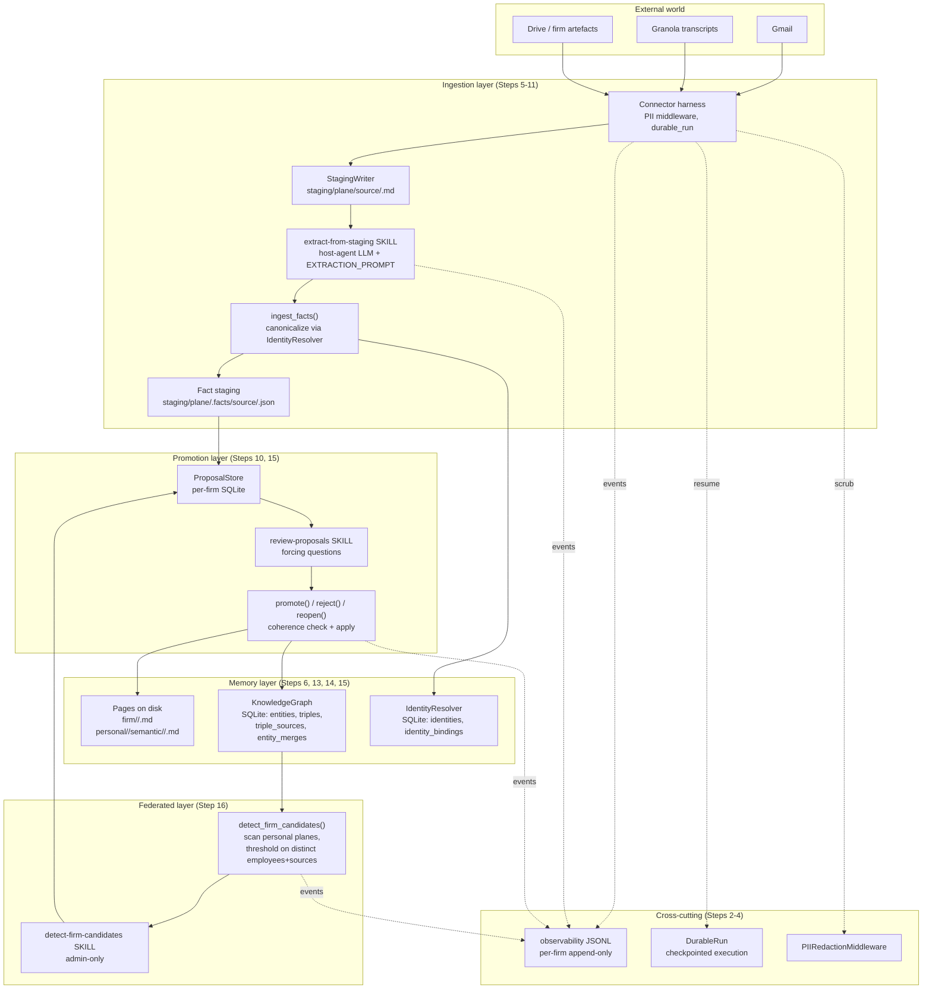

# Memory Mission — Architecture

*Current shipped state, 2026-04-22. For the "why" see [VISION.md](VISION.md). For per-step history see [BUILD_LOG.md](../BUILD_LOG.md). For the domain model see [ABSTRACTIONS.md](ABSTRACTIONS.md).*

---

## Design principles

### 1. Two planes, one-way bridge

Memory Mission splits firm knowledge into **personal planes** (per-employee, private) and a **firm plane** (shared, governed). The only path from personal to firm is the promotion pipeline — `create_proposal` → `review-proposals` skill surfaces to a human → `promote()` with required rationale. Nothing else writes to the firm plane.

### 2. Filesystem as single source of truth

The on-disk markdown vault is authoritative for pages. The SQLite knowledge graph and the observability JSONL log are derived indexes built from promotion events. Any of them can be rebuilt by replaying the other two. When they disagree, filesystem + promotion audit trail win.

### 3. Provenance mandatory

Every fact traces to source. Every promotion records reviewer + rationale. Every corroboration appends to `triple_sources` with the new source. The audit chain never loses a node.

### 4. Deterministic primitives, human judgment

Mechanical work (corroborate, check coherence, detect federated patterns, merge entities) is pure Python + SQL + Pydantic — no LLM, no probabilistic reasoning in the core primitives. Editorial work (approve proposals, merge identities, change tiers) routes through human review. This split is load-bearing: eval strategy (see `EVALS.md`) relies on it, and compliance audits rely on it.

### 5. LLM lives with the host agent

Memory Mission ships prompt templates, typed schemas, ingest validators, and skill markdown. It never imports an LLM SDK (`anthropic`, `openai`, `google-generativeai`). The host agent — Claude Code, Codex, Hermes — runs the model. This keeps the library deployable in any runtime and keeps model-provider choice with whoever has the API key.

### 6. Per-firm isolation

One firm = one directory tree + one SQLite knowledge graph + one identity resolver + one proposal store + one observability log. Paths are fenced; cross-firm queries are not possible by construction. Firms are deployed as separate instances.

### 7. Coherence under change

Lower tiers (`decision` < `policy` < `doctrine` < `constitution`) must not silently contradict higher tiers. The promotion pipeline emits `CoherenceWarningEvent` for every conflict detected. Firms in `constitutional_mode` have `CoherenceBlockedError` raised before the write lands.

### 8. Identity is infrastructure, not a feature

Stable `PersonID` / `OrgID` from an `IdentityResolver` backs every reference. The LLM emits free-form entity names + identifiers; canonicalization happens at `ingest_facts()` time before anything touches the KG. Downstream code speaks in stable IDs.

### 9. Adapter pattern for external services

Three places where external services plug in, all via the same pattern (Protocol + local default impl + optional external adapter): `Connector` (Composio / Gmail / Drive / Granola), `EmbeddingProvider` (OpenAI / Gemini / local hash stub), `IdentityResolver` (Graph One / Clay / firm-custom / local email-based). Ship the Protocol; host wires the service.

### 10. Skills are markdown

Workflows live as `skills/<name>/SKILL.md` with YAML frontmatter (`name`, `version`, `triggers`, `tools`, `preconditions`, `constraints`, `category`) and a destinations-and-fences body. Registered in `skills/_index.md` (human-readable) + `skills/_manifest.jsonl` (machine-readable). The host-agent runtime loads them.

---

## System diagram



---

## Three representations, one authority

Firm state exists in three derived forms simultaneously. They must never diverge permanently; when they disagree, the rule is: **filesystem + observability audit log win, KG is rebuildable from promotion events**.

| Layer | Storage | Built from | Owned by |
|---|---|---|---|
| Pages | `firm/<domain>/<slug>.md` + `personal/<emp>/semantic/<domain>/<slug>.md` | direct writes via `promote()` and curator workflows | `memory/pages.py`, `memory/engine.py` |
| Knowledge graph | `<firm>/firm-kg.sqlite3` | replay of promote() facts via `_apply_facts` | `memory/knowledge_graph.py` |
| Observability log | `<firm>/events.jsonl` | append-only on every event | `observability/logger.py` |

The KG is a derived index. If it corrupts, rebuild from promotion events. The observability log is authoritative for "what happened"; pages are authoritative for "what is currently true."

---

## Module walkthrough

### `src/memory_mission/observability/` — component 0.4

Append-only JSONL per firm, scoped by a context manager (`observability_scope`) that injects `firm_id` / `employee_id` / `trace_id` into every event. Event types are a Pydantic discriminated union: `ExtractionEvent`, `PromotionEvent`, `RetrievalEvent`, `DraftEvent`, `ConnectorInvocationEvent`, `ProposalCreatedEvent`, `ProposalDecidedEvent`, `CoherenceWarningEvent`.

Public API: `observability_scope(...)`, `log_extraction(...)`, `log_retrieval(...)`, `log_proposal_created(...)`, `log_proposal_decided(...)`, `log_coherence_warning(...)`, `log_draft(...)`, `log_connector_invocation(...)`.

Path safety: `firm_id` is validated against a regex and resolved-path check to block traversal.

### `src/memory_mission/durable/` — component 0.6

Checkpointed execution for long-running ingestion loops. `DurableRun` wraps a loop, persists per-step state to a per-firm SQLite thread store, and resumes from the last checkpoint on restart. Integrates with observability — durable runs auto-seed `trace_id` into thread state so events and resume state correlate post-hoc.

Terminal states are respected: a completed thread cannot be flipped back to running by a reopen.

### `src/memory_mission/middleware/` — component 0.7

`MiddlewareChain` wraps LLM calls with deterministic middleware. Primary member today: `PIIRedactionMiddleware` with a public `.scrub(text)` API. Compliance-focused rules (8-17 digit account numbers, email addresses, phone numbers) plus a generic structured-data redaction pass.

`ModelCall` / `ModelResponse` are frozen Pydantic — middleware uses `model_copy(update=...)` to produce the next-in-chain value; accidental mutation is structurally blocked.

### `src/memory_mission/connectors/` — component 1.3

`Connector` Protocol + local test doubles + Composio-backed implementations for Gmail, Granola, Drive. Every invocation flows through a shared harness (`invoke()`) that threads observability + PII scrub + trace_id correlation.

Composio SDK is a stub today — the `ComposioClient` Protocol is defined; live wiring happens when a firm deploys. Granola's coverage confirmed by the user; Gmail harness ships without live test per Step 5 scope.

### `src/memory_mission/ingestion/` — Step 7

`StagingWriter` writes pulled items to `<wiki_root>/staging/<plane>/<source>/` with atomic `.tmp → rename` and path-safety checks. `MentionTracker` is a per-firm SQLite store of entity counts; `record()` returns `(prev_tier, new_tier)` so the extraction skill can fire higher-tier enrichment on threshold crossings (GBrain's 1 / 3 / 8 thresholds).

### `src/memory_mission/memory/` — components 0.1 + 0.2 + Steps 6, 13, 15

- **`pages.py`** — parse/render compiled-truth + timeline markdown; `PageFrontmatter` Pydantic (slug, title, domain, aliases, sources, validity window, confidence, **tier**).
- **`schema.py`** — domain registry (`people`, `companies`, `deals`, `meetings`, `concepts`, `sources`, `inbox`, `archive`) and path helpers (`plane_root`, `curated_root`, `page_path`, `staging_source_dir`).
- **`engine.py`** — `BrainEngine` Protocol + `InMemoryEngine` in-memory implementation. `put_page`, `get_page`, `list_pages`, `search`, `query` (hybrid search with RRF + compiled-truth boost + cosine blend). `query()` accepts `tier_floor` for authority-filtered retrieval.
- **`search.py`** — hybrid retrieval primitives (`EmbeddingProvider` Protocol, `HashEmbedder` default, `rrf_fuse`, `cosine_similarity`, `COMPILED_TRUTH_BOOST=2.0`, `RRF_K=60`, `VECTOR_RRF_BLEND=0.7`).
- **`knowledge_graph.py`** — SQLite temporal knowledge graph. Tables: `entities`, `triples`, `triple_sources`, `entity_merges`. Core ops: `add_entity`, `add_triple`, `invalidate`, `query_entity`, `query_relationship`, `timeline`, `find_current_triple`, **`corroborate`** (Noisy-OR capped at 0.99), **`merge_entities`** (reviewer-gated), **`check_coherence`** (deterministic conflict detector), **`sql_query`** (read-only SQL surface), `scan_triple_sources` (the join the federated detector needs), `stats`.
- **`tiers.py`** — `Tier = Literal["constitution", "doctrine", "policy", "decision"]` with ordinal helpers (`tier_level`, `is_above`, `is_at_least`).
- **`text.py`** — `word_set` + `jaccard` (lifted from agentic-stack).
- **`salience.py`** — `salience_score(entry)` formula (lifted from agentic-stack).

### `src/memory_mission/extraction/` — Step 9

- **`schema.py`** — Pydantic discriminated union of six fact kinds: `IdentityFact`, `RelationshipFact`, `PreferenceFact`, `EventFact`, `UpdateFact`, `OpenQuestion`. Every fact carries `confidence` (0-1) + `support_quote` (non-empty) — "no quote, no fact". `ExtractionReport` bundles facts + metadata.
- **`prompt.py`** — `EXTRACTION_PROMPT` markdown template: the six schemas + a worked venture-firm example + rules. Host agent feeds this to its LLM.
- **`ingest.py`** — `ExtractionWriter` (per-plane, per-source persistence), `ingest_facts(report, *, wiki_root, mention_tracker, identity_resolver)` — the canonicalization step. When a resolver is provided, `IdentityFact.identifiers` are resolved to stable `p_<id>` / `o_<id>`; every fact in the report that references the same raw name is rewritten. The canonicalized report is what lands in fact staging.

### `src/memory_mission/identity/` — Step 14

- **`base.py`** — `IdentityResolver` Protocol (`resolve` / `lookup` / `bindings` / `get_identity`), `Identity` Pydantic, `IdentityConflictError`, `parse_identifier`, `make_entity_id` (`p_<token>` / `o_<token>`).
- **`local.py`** — `LocalIdentityResolver` — SQLite-backed default. Exact-match on `type:value` identifiers. Conservative by design (no fuzzy name match in V1) — false negatives are recoverable via `merge_entities`, false positives are expensive.

### `src/memory_mission/promotion/` — Step 10

- **`proposals.py`** — `Proposal` + `DecisionEntry` + `ProposalStatus` + `ProposalStore` (per-firm SQLite queue indexed on status / target_entity / target_plane). Deterministic `proposal_id` from inputs means `create_proposal` is idempotent — re-extraction from the same source returns the existing pending proposal.
- **`pipeline.py`** — `create_proposal`, `promote` (accepts optional `policy: Policy | None` for constitutional mode), `reject`, `reopen`. Shared `_apply_facts` two-pass: (1) coherence scan emits `CoherenceWarningEvent`s, raises `CoherenceBlockedError` in strict mode; (2) `_add_or_corroborate` routes each triple-like fact to `corroborate` (if currently-true match exists) or `add_triple` (if new).

### `src/memory_mission/permissions/` — Step 8

`Policy` Pydantic (firm_id, scopes, employees, default_scope, **constitutional_mode**) + `can_read(policy, employee_id, page)` + `can_propose(policy, employee_id, target_scope)`. No-escalation rule on propose: can't propose into a scope you can't read. Pure library — host-agent skills call as utilities.

### `src/memory_mission/federated/` — Step 16

`FirmCandidate` + `CandidateSource` Pydantic, `detect_firm_candidates(kg, *, min_employees=3, min_sources=3)` (deterministic SQL scan + grouping), `propose_firm_candidate(candidate, *, store)` (uses `create_proposal` for idempotency). The dominant failure mode — three employees ingesting one shared transcript — is caught by the distinct-source-file threshold.

### `src/memory_mission/personal_brain/` — Step 12

Per-employee four-layer brain: `working/WORKSPACE.md` (current task state, 2-day archive), `episodic/AGENT_LEARNINGS.jsonl` (salience-ranked), `semantic/<domain>/<slug>.md` (curated pages — existing shape moved under `semantic/`), `preferences/PREFERENCES.md`, `lessons/lessons.jsonl` + rendered `LESSONS.md`. Workflow agents read these before drafting anything.

---

## Runtime composition

A typical end-to-end flow composes like this:

```python
with observability_scope(observability_root=..., firm_id="acme", employee_id="alice"):
    with durable_run(store=..., thread_id="gmail-backfill-2026-q2", firm_id="acme") as run:
        # Every step checkpointed — resume-on-crash works.
        for message in connector.invoke("list_messages", params={...}):
            run.step(message["id"])
            staging.write(message, source="gmail", target_plane="personal",
                          employee_id="alice")
            run.mark_done(message["id"])

# ...later, extraction...
with observability_scope(...):
    report = ExtractionReport.model_validate_json(llm_response)
    result = ingest_facts(
        report,
        wiki_root=...,
        mention_tracker=tracker,
        identity_resolver=resolver,  # canonicalizes entity names
    )

# ...later, review...
with observability_scope(...):
    for proposal in store.list(status="pending"):
        # review-proposals SKILL surfaces each one to a human
        promote(store, kg, proposal.proposal_id,
                reviewer_id="partner-1",
                rationale="verified against source",
                policy=policy)  # constitutional_mode gates coherence
```

Every layer logs to the same observability scope; every write to memory carries the same `trace_id`.

---

## Stack

| Layer | Technology | Rationale |
|---|---|---|
| Language | Python 3.12+ | Hermes is Python-native; MemPalace KG ports cleanly; GBrain patterns are ~2-3K LOC to port |
| Data | SQLite (stdlib) for KG, identity, proposals, mentions, durable runs | Zero-dep, per-firm file = per-firm isolation, migration-ready schema for Postgres |
| Storage | Filesystem (markdown + YAML) for pages | Obsidian-compatible, AI-legible, no lock-in |
| Search | Hybrid (keyword + vector, RRF-fused, cosine-blended) via `HashEmbedder` stub | Real embedder slots in via Protocol |
| Models | Pydantic v2 | Typed, frozen, JSON round-trippable |
| Validation | mypy --strict | On every source file |
| Lint / format | ruff + ruff format | Fast, canonical |
| Tests | pytest | 602 tests, every public surface |
| Runtime | Hermes Agent (primary), Ironclaw / OpenClaw (others) | Skills are markdown; any host that reads frontmatter can load them |

---

## Non-goals

- **Multi-firm SaaS.** V1 is per-firm-instance. Shared-SaaS with RLS is deferred until firm count justifies the infra complexity.
- **LLM runtime.** Host agent owns it. We ship prompts and schemas.
- **UI.** Vault is Obsidian-compatible; review surface is the host agent's chat. A dedicated web UI is a later layer.
- **Automatic conflict resolution.** Coherence warnings are advisory or blocking — never auto-resolving. The reviewer decides.

---

## Data flow: a concrete example

Alice runs the Gmail backfill skill. Three weeks of email stream into `staging/personal/alice/gmail/`. The extract-from-staging skill chews through them — for each message, the host agent calls its LLM with `EXTRACTION_PROMPT`, parses the JSON into an `ExtractionReport`, passes it to `ingest_facts(..., identity_resolver=alice_resolver)`. One `IdentityFact` carries `identifiers=["email:sarah@acme.com", "linkedin:sarah-chen"]`. The resolver returns `p_abc123`. Every fact in the report referencing `sarah-chen` is rewritten to `p_abc123`. The canonicalized report lands in `staging/personal/alice/.facts/gmail/<message-id>.json`.

Promotion turns fact groups into `Proposal` objects. Alice reviews each via the `review-proposals` skill. She approves a `(p_abc123, works_at, acme-corp)` triple with rationale "confirmed in onboarding email + LinkedIn profile." `_apply_facts` runs coherence scan (no conflicts), then `_add_or_corroborate`. Since this is Alice's first extraction, `add_triple` fires; source is `personal/alice`, provenance seeded with the report path.

Two weeks later, Bob and Carol each run the same flow against their own Gmail. Their extractions resolve `sarah@acme.com` to the same `p_abc123` (identity is per-firm, not per-employee). Their promotions corroborate Alice's triple rather than creating duplicates — confidence climbs toward 0.99 via Noisy-OR.

Admin runs `detect-firm-candidates`. Detector sees `p_abc123 works_at acme-corp` backed by `personal/alice`, `personal/bob`, `personal/carol` — three distinct closets, three distinct source files. Fires a federated proposal. Admin stages via `propose_firm_candidate`. The firm-plane reviewer approves. `_apply_facts` sees a currently-true match and corroborates with `source_closet=firm`; now the triple carries a fourth source.

Later, a meeting-prep agent (Step 17) queries the KG for everything about `p_abc123` at tier_floor `policy`. Sees the corroborated `works_at acme-corp`, backed by four sources, each traceable back through `decision_history` to a specific reviewer + rationale.

That's the loop. Every link is auditable. No link was silent.
